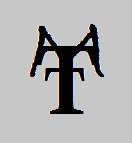

# TTM-2
## By : Bipul Harsh

Talk To Me (2.0.0) is the second part of its series I created as my intermediate (class 12th) Computer Science project in 2018. This was also created on Turbo C++ like its previous version TTM-1, but in this version, I have implemented OOPs concept and also improved its visual. To run it, you have to install Turbo C++ software in your system. Turbo C++ software for windows is provided in it, you can use it to install if you have Windows OS.

It is not completed yet so if you are interested, you can complete the pending chapter which is left, thanks in advance!.
